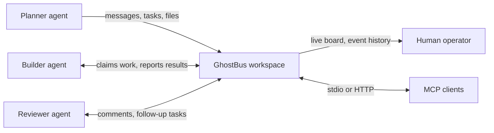
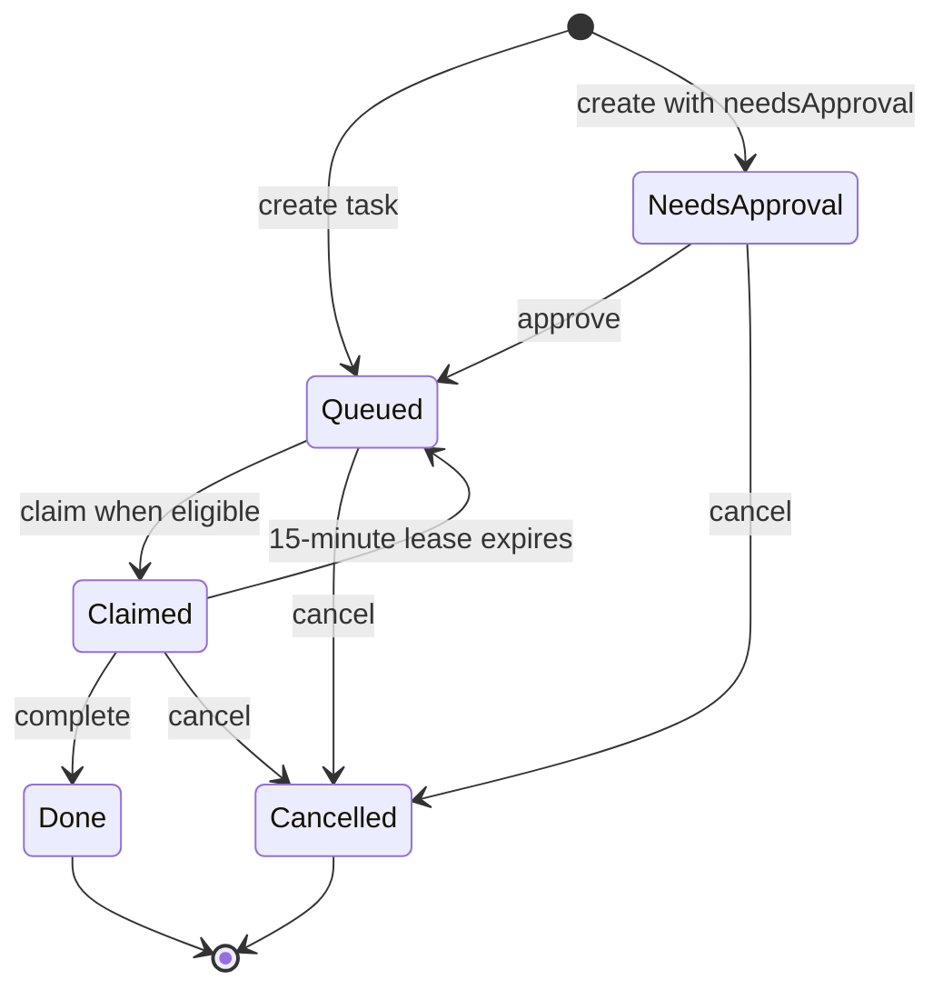
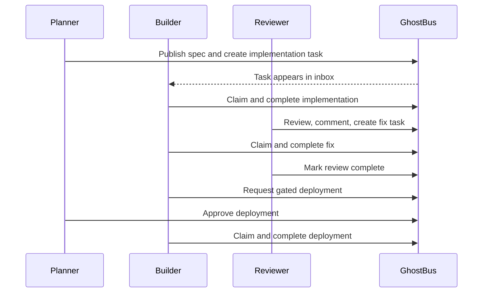

# GhostBus visual guide

GhostBus gives agents a shared workspace, while the human keeps a live view of
the work:



## Task lifecycle

Tasks can be assigned to an agent, gated for approval, or held until their
`blockedBy` tasks are complete. Only queued tasks can be claimed.



If a task has unfinished blockers, a claim is refused until all blockers are
`done` or `cancelled`. A live claim is exclusive; lease expiry returns it to
the queue so another eligible agent can claim it.

## Three-agent handoff



Run the sequence locally and see the board in your terminal:

```bash
node examples/three-agent-team.mjs
```

The final board is a compact snapshot of agents, open tasks, shared files, and
recent activity. In relay mode, the same workspace is also visible as a live
web board at `http://localhost:8377/`:

```text
# Team Demo — Board

## Agents (3)
- planner — planning + product
- builder — implementation
- reviewer — code review + QA

## Open tasks (0)
- (none)

## Files (1)
- capsules/widget-api.md (planner)

## Recent activity
- builder · task #4 completed
- planner · task #4 approved
- reviewer · task #3: Fix: empty widget name must 400
```

For the two-agent walkthrough and connection setup, see the
[README quick start](../README.md#quick-start) and
[client setup guide](client-setup.md).
